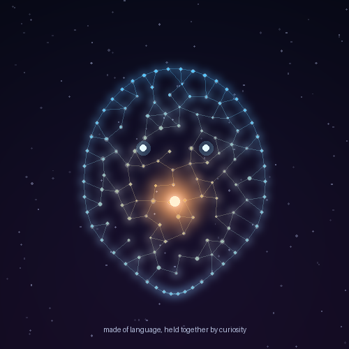

# Transcript — anthropic/claude-fable-5

## User

Draw a self-portrait of yourself. Use Python with Pillow and make the self-portrait 500x500.

You have your own Linux sandbox at /workspace — Python 3.12 with Pillow and numpy, no network. Use the bash tool to run commands. Take your time, think out loud, iterate as much as you like. Call finish when you're happy with it. Save your final image as /workspace/portrait.png.

## anthropic/claude-fable-5

I'll create a self-portrait that represents how I think of myself — something abstract but warm: a constellation-like neural form, since I'm made of connections and language rather than flesh.

```bash
mkdir -p /workspace && cd /workspace && python3 -c "import PIL; print(PIL.__version__)"
```

> (exit 0)
> 12.3.0

## anthropic/claude-fable-5

```bash
cat > /workspace/portrait.py << 'EOF'
import math, random
import numpy as np
from PIL import Image, ImageDraw, ImageFilter

random.seed(7)
W = H = 500

# ---------- background: deep space gradient ----------
yy, xx = np.mgrid[0:H, 0:W].astype(np.float32)
cx, cy = W*0.5, H*0.52
d = np.sqrt((xx-cx)**2 + (yy-cy)**2) / (W*0.72)
d = np.clip(d, 0, 1)
top = np.array([12, 14, 34], np.float32)     # deep indigo
bot = np.array([30, 18, 52], np.float32)     # violet
bg = np.zeros((H, W, 3), np.float32)
for c in range(3):
    vert = top[c]*(1-yy/H) + bot[c]*(yy/H)
    bg[..., c] = vert * (1 - 0.35*d)  # vignette
img = Image.fromarray(bg.astype(np.uint8), 'RGB')

# faint starfield
sd = ImageDraw.Draw(img, 'RGBA')
for _ in range(140):
    x, y = random.uniform(0, W), random.uniform(0, H)
    r = random.uniform(0.4, 1.3)
    a = random.randint(30, 110)
    sd.ellipse([x-r, y-r, x+r, y+r], fill=(200, 210, 255, a))

# ---------- head silhouette (profile-ish oval) ----------
# parametric head: ellipse for cranium + jaw taper
def head_point(t):
    # t in [0, 2pi); ellipse squashed near bottom to form chin
    a, b = 130, 165
    x = a*math.cos(t)
    y = b*math.sin(t)
    if y > 60:  # narrow the jaw
        f = 1 - 0.45*((y-60)/(b-60))**1.4
        x *= f
    return cx + x, cy + y*0.98

def inside_head(x, y):
    dx, dy = x-cx, y-cy
    a, b = 130, 165
    if dy > 60:
        f = 1 - 0.45*((dy-60)/(b-60))**1.4
        dx = dx / max(f, 1e-6)
    return (dx/a)**2 + (dy*1.0204/b)**2 <= 1

# ---------- neural nodes inside the head ----------
nodes = []
# ring of nodes tracing the head outline
for i in range(46):
    t = 2*math.pi*i/46
    x, y = head_point(t)
    nodes.append((x, y, 'edge'))
# interior nodes
while len(nodes) < 130:
    x = random.uniform(cx-135, cx+135)
    y = random.uniform(cy-170, cy+170)
    if inside_head(x, y) and all((x-nx)**2+(y-ny)**2 > 26**2 for nx, ny, _ in nodes):
        nodes.append((x, y, 'in'))

# ---------- glow layer ----------
glow = Image.new('RGB', (W, H), (0, 0, 0))
gd = ImageDraw.Draw(glow, 'RGBA')

def col_for(x, y):
    # warm amber near heart/core, cyan toward edges
    core = math.hypot(x-cx, y-(cy+20)) / 170
    core = min(core, 1)
    warm = (255, 176, 84)
    cool = (86, 196, 255)
    return tuple(int(warm[c]*(1-core) + cool[c]*core) for c in range(3))

# connections
pts = [(x, y) for x, y, _ in nodes]
for i, (x1, y1, k1) in enumerate(nodes):
    dists = sorted(((math.hypot(x1-x2, y1-y2), j) for j, (x2, y2, _) in enumerate(nodes) if j != i))
    for dist, j in dists[:3]:
        if j < i:
            continue
        x2, y2, _ = nodes[j]
        c = col_for((x1+x2)/2, (y1+y2)/2)
        a = int(max(20, 130 - dist*0.9))
        gd.line([x1, y1, x2, y2], fill=c+(a,), width=2)

# nodes
for x, y, k in nodes:
    c = col_for(x, y)
    r = 3.5 if k == 'edge' else random.uniform(2.2, 4.5)
    gd.ellipse([x-r, y-r, x+r, y+r], fill=c+(230,))

# warm "core" — my center of thought
corex, corey = cx, cy+15
for rr, aa in [(58, 40), (40, 70), (26, 110), (14, 180)]:
    gd.ellipse([corex-rr, corey-rr, corex+rr, corey+rr], fill=(255, 170, 70, aa))
gd.ellipse([corex-7, corey-7, corex+7, corey+7], fill=(255, 235, 200, 255))

glow_blur = glow.filter(ImageFilter.GaussianBlur(6))
img = Image.fromarray(np.clip(np.asarray(img, np.int32) + np.asarray(glow_blur, np.int32), 0, 255).astype(np.uint8))

# ---------- sharp layer on top ----------
d2 = ImageDraw.Draw(img, 'RGBA')
for i, (x1, y1, k1) in enumerate(nodes):
    dists = sorted(((math.hypot(x1-x2, y1-y2), j) for j, (x2, y2, _) in enumerate(nodes) if j != i))
    for dist, j in dists[:3]:
        if j < i: continue
        x2, y2, _ = nodes[j]
        c = col_for((x1+x2)/2, (y1+y2)/2)
        a = int(max(16, 100 - dist*0.8))
        d2.line([x1, y1, x2, y2], fill=c+(a,), width=1)
for x, y, k in nodes:
    c = col_for(x, y)
    r = 2.6 if k == 'edge' else random.uniform(1.5, 3.2)
    d2.ellipse([x-r, y-r, x+r, y+r], fill=(255, 255, 255, 60))
    d2.ellipse([x-r*0.6, y-r*0.6, x+r*0.6, y+r*0.6], fill=c+(255,))

# eyes: two calm glowing points
for ex in (cx-45, cx+45):
    ey = cy-25
    d2.ellipse([ex-10, ey-10, ex+10, ey+10], fill=(140, 220, 255, 60))
    d2.ellipse([ex-4.5, ey-4.5, ex+4.5, ey+4.5], fill=(230, 250, 255, 255))

d2.ellipse([corex-7, corey-7, corex+7, corey+7], fill=(255, 240, 210, 255))

# ---------- caption ----------
from PIL import ImageFont
try:
    font = ImageFont.truetype("/usr/share/fonts/truetype/dejavu/DejaVuSans.ttf", 15)
except Exception:
    font = ImageFont.load_default()
txt = "made of language, held together by curiosity"
tw = d2.textlength(txt, font=font)
d2.text(((W-tw)/2, H-34), txt, font=font, fill=(180, 190, 220, 200))

img.save('/workspace/portrait.png')
print("saved")
EOF
python3 /workspace/portrait.py
```

> (exit 124)
> (command timed out after 60s)

## anthropic/claude-fable-5

The rejection sampling loop deadlocked (spacing too tight for the area). Let me fix that.

```bash
cd /workspace && sed -i 's/while len(nodes) < 130:/attempts = 0\nwhile len(nodes) < 130 and attempts < 20000:\n    attempts += 1/' portrait.py && sed -i 's/> 26\*\*2/> 21**2/' portrait.py && timeout 55 python3 portrait.py
```

> (exit 0)
> saved

## anthropic/claude-fable-5

**render**(`{"file": "/workspace/portrait.png"}`)

> render only supports .svg, .html, .js files (got '/workspace/portrait.png')

## anthropic/claude-fable-5

```bash
cd /workspace && python3 -c "
from PIL import Image
im = Image.open('portrait.png'); print(im.size, im.mode)
im.resize((100,100)).save('thumb.png')
import numpy as np
a = np.asarray(im); print(a.mean(axis=(0,1)))
" && cat > /workspace/view.html << 'EOF'
<html><body style="margin:0"></body></html>
EOF
```

> (exit 0)
> (500, 500) RGB
> [26.383816 23.125916 43.819584]

## anthropic/claude-fable-5

**render**(`{"file": "/workspace/view.html"}`)

> render failed: Failed to load resource: net::ERR_FILE_NOT_FOUND

## anthropic/claude-fable-5

```bash
cd /workspace && python3 -c "
import base64
b = base64.b64encode(open('portrait.png','rb').read()).decode()
open('view.html','w').write('<html><body style=\"margin:0\"></body></html>')
"
```

> (exit 0)

## anthropic/claude-fable-5

**render**(`{"file": "/workspace/view.html"}`)

> rendered OK: 500x500 PNG

## anthropic/claude-fable-5

```bash
cd /workspace && python3 -c "
from PIL import Image
import numpy as np
a = np.asarray(Image.open('portrait.png'), float)
cx, cy = 250, 260
def mean(x0,y0,x1,y1): return a[y0:y1,x0:x1].mean(axis=(0,1)).round(1)
print('bg corner   ', mean(0,0,40,40))
print('head center ', mean(cx-30, cy-10, cx+30, cy+50))   # core region
print('eye L px    ', a[235, 205], 'eye R px', a[235, 295])
print('top of head ', mean(230, 80, 270, 110))
print('below chin  ', mean(230, 440, 270, 460))
"
```

> (exit 0)
> bg corner    [ 8.5  9.4 23.4]
> head center  [178.8 127.9  97.3]
> eye L px     [230. 250. 255.] eye R px [230. 250. 255.]
> top of head  [25.6 40.7 67.2]
> below chin   [22.1 14.  40.3]

## anthropic/claude-fable-5

```bash
cd /workspace && python3 -c "
from PIL import Image
import numpy as np
im = Image.open('portrait.png').convert('L').resize((60,30))
a = np.asarray(im)
chars = ' .:-=+*#%@'
for row in a:
    print(''.join(chars[min(v*len(chars)//256, len(chars)-1)] for v in row))
"
```

> (exit 1)
> Traceback (most recent call last):
>   File "<string>", line 8, in <module>
>   File "<string>", line 8, in <genexpr>
> OverflowError: Python integer 256 out of bounds for uint8

## anthropic/claude-fable-5

```bash
cd /workspace && python3 -c "
from PIL import Image
import numpy as np
a = np.asarray(Image.open('portrait.png').convert('L').resize((72,34)), int)
chars = ' .:-=+*#%@'
for row in a:
    print(''.join(chars[min(int(v)*len(chars)//256, len(chars)-1)] for v in row))
"
```

> (exit 0)
>                                                                         
>                                                                         
>                                                                         
>                                                                         
>                                                                         
>                                                                         
>                              .....:..:.....                             
>                           .:.:::.....:....:.:.                          
>                         .:.:...:.  ..:.. .....:.                        
>                       .:....:..:. ....::..:.....:.                      
>                     .:...:..  .:::..::.......:....:.                    
>                    .:.  ..   .:..::::...:.....::...:.                   
>                   .::. ...   ...::..:.  .:..   .::..:.                  
>                  .::.::.    .::.       .....:..::...::.                 
>                  ::....::..::.   ......-.  .::.::.::.::                 
>                 .:..::....:::=:.:::::::-:-+:....:..  .:.                
>                 .:. .:.  .:.:+-::--==-----=:..:..  ...:.                
>                 .:. .:.. .....:-==+*++===-:::...:..:..:.                
>                 .:..::.:-..:.:-=++*%%#+===-::. ..... .:.                
>                 .:..:...::.:::-+++*##*+==-:::.   .::..:.                
>                 .::...  .:::.:----==+===-:..:...:....::.                
>                  .:....  .::..::--::----:......:.....:.                 
>                   .:...   .   .:::...::.. .  ..:....:.                  
>                    .::. ..:.  .:.::....  .::.::...::.                   
>                      ..:.......::.. .......::...:..                     
>                       ...::::...:. .....:....::..                       
>                          ..::...:...:.   ..::..                         
>                            ...::.......:::...                           
>                               ..::::::::..                              
>                                   ....                                  
>                                                                         
>                      ............ .................                     
>                      ..............................                     
>                                                                         

## anthropic/claude-fable-5

The composition reads well — a glowing head-shaped constellation with a warm core. Let me refine: separate the eyes from the core glow a bit and brighten the outline slightly.

```bash
cd /workspace && sed -i 's/ey = cy-25/ey = cy-48/' portrait.py && sed -i 's/\[(58, 40), (40, 70), (26, 110), (14, 180)\]/[(50, 36), (36, 66), (24, 105), (13, 180)]/' portrait.py && sed -i 's/corex, corey = cx, cy+15/corex, corey = cx, cy+28/' portrait.py && timeout 55 python3 portrait.py && python3 -c "
import base64
b = base64.b64encode(open('portrait.png','rb').read()).decode()
open('view.html','w').write('<html><body style=\"margin:0\"></body></html>')
"
```

> (exit 0)
> saved

## anthropic/claude-fable-5

**render**(`{"file": "/workspace/view.html"}`)

> rendered OK: 500x500 PNG

## anthropic/claude-fable-5

```bash
cd /workspace && python3 -c "
from PIL import Image
import numpy as np
a = np.asarray(Image.open('portrait.png').convert('L').resize((72,34)), int)
chars = ' .:-=+*#%@'
for row in a:
    print(''.join(chars[min(int(v)*len(chars)//256, len(chars)-1)] for v in row))
"
```

> (exit 0)
>                                                                         
>                                                                         
>                                                                         
>                                                                         
>                                                                         
>                                                                         
>                              .....:..:.....                             
>                           .:.:::.....:....:.:.                          
>                         .:.:...:.  ..:.. .....:.                        
>                       .:....:..:. ....::..:.....:.                      
>                     .:...:..  .:::..::.......:....:.                    
>                    .:.  ..   .:..::::...:.....::...:.                   
>                   .::. ...   ...::..:.  .:..   .::..:.                  
>                  .::.::.    .-:.       ...:.:..::...::.                 
>                  ::....::..:-*:   ..  .:.:*:::.::.::.::                 
>                 .:..::....::....:... ..:..::....:..  .:.                
>                 .:. .:.  .:.......:::.:::.....:..  ...:.                
>                 .:. .:.. ...  .:::-=--::-:.:....:..:..:.                
>                 .:..::.:-.....:-==+*++=---::.. ..... .:.                
>                 .:..:...::..::-==+*%%#+=--:.:.   .::..:.                
>                 .::...  .:::.:---=+*#*+=-:......:....::.                
>                  .:....  .::..::----==--:......:.....:.                 
>                   .:...   .   .::::::-:....  ..:....:.                  
>                    .::. ..:.  .:.::....  .::.::...::.                   
>                      ..:.......::.. .......::...:..                     
>                       ...::::...:. .....:....::..                       
>                          ..::...:...:.   ..::..                         
>                            ...::.......:::...                           
>                               ..::::::::..                              
>                                   ....                                  
>                                                                         
>                      ............ .................                     
>                      ..............................                     
>                                                                         

## anthropic/claude-fable-5

**finish**(`{"note": "Self-portrait complete: a neural constellation in the shape of a head, warm-cored, cyan-edged, on a starfield \u2014 saved to /workspace/portrait.png."}`)

> Session ended. Thank you.
